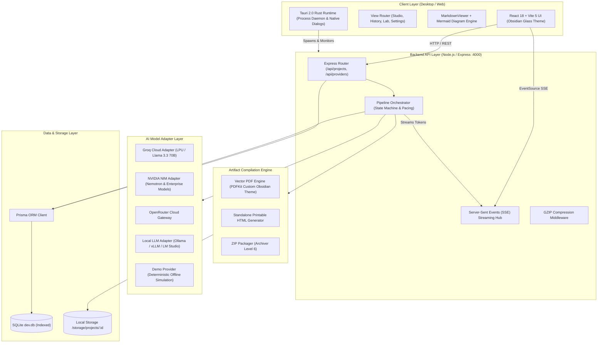

<p align="center">
  
</p>

<h1 align="center">Archly — Official GitHub Repository</h1>

<p align="center">
  <strong>Autonomous Technical Architecture Compiler & Engineering Specification Engine</strong><br/>
  <em>Created by <a href="https://github.com/AJisnotavailable">AJisnotavailable</a> &bull; Official Repository: <a href="https://github.com/AJisnotavailable/Archly">github.com/AJisnotavailable/Archly</a></em>
</p>

<p align="center">
  <em>Transform any raw product concept into an exhaustive, 14-stage, implementation-ready engineering blueprint — complete with C4 diagrams, database schemas, REST APIs, roadmap Gantts, vector PDFs, and code scaffolding.</em>
</p>

<p align="center">
  <a href="https://github.com/AJisnotavailable/Archly/actions/workflows/ci.yml"></a>
  <a href="https://ajisnotavailable.github.io/Archly"></a>
  <a href="https://github.com/AJisnotavailable/Archly/stargazers"></a>
  <a href="#license"></a>
  <a href="https://tauri.app/"></a>
  <a href="https://react.dev/"></a>
  <a href="https://www.typescriptlang.org/"></a>
  <a href="https://github.com/AJisnotavailable"></a>
</p>

<p align="center">
  <a href="https://github.com/AJisnotavailable/Archly/releases/tag/v1.0.0"></a>
  <a href="https://github.com/AJisnotavailable/Archly/releases/download/v1.0.0/Archly-v1.0.0-Setup-x64.exe"></a>
  <a href="https://github.com/AJisnotavailable/Archly/releases/download/v1.0.0/Archly-v1.0.0-x64.exe"></a>
</p>

---

## 📸 Interface Preview

<p align="center">
  
  
</p>
<p align="center">
  
  
</p>

---

## ⚡ What is Archly?

Welcome to the official **Archly GitHub** repository ([github.com/AJisnotavailable/Archly](https://github.com/AJisnotavailable/Archly)). **Archly** is an autonomous developer platform and native desktop workstation designed for software engineers, technical founders, and product architects. 

Designing modern software typically demands dozens of hours of upfront planning before writing the first line of code: evaluating tech stacks, diagramming system architectures, designing normalized ER databases, structuring APIs, mapping state machines, organizing repositories, and formulating risk registers.

Archly fully automates this pre-development phase. Given a single prompt (e.g., *"A distributed task queue in Go with Redis broker, SQLite WAL persistence, and real-time WebSockets analytics"*), Archly:

1. **Clarifies Scope (Stage 1)**: Interactively identifies edge cases, expected throughput, deployment targets, and scale requirements.
2. **Compiles 14 Sequential Stages**: Maintains strict cross-stage architectural context to eliminate hallucinations and contradictions.
3. **Generates Live Dynamic Diagrams**: Renders interactive Mermaid.js C4 topographies, sequence diagrams, ER diagrams, state machines, and Gantt charts.
4. **Compiles Production Artifacts**: Generates vector-grade PDF blueprints, standalone printable HTML documents, and packaged ZIP bundles ready for engineering teams and stakeholders.

---

## 📑 Table of Contents

- [Key Capabilities](#-key-capabilities)
- [The 14-Stage Compilation Pipeline](#-the-14-stage-compilation-pipeline)
- [System Architecture](#-system-architecture)
- [Supported Inference Engines & BYOK](#-supported-inference-engines--byok)
- [Monorepo Structure](#-monorepo-structure)
- [Getting Started & Local Setup](#-getting-started--local-setup)
- [Desktop App Packaging (Tauri 2.0)](#-desktop-app-packaging-tauri-20)
- [Security, Privacy & Data Isolation](#-security-privacy--data-isolation)
- [Attribution & Creator](#-attribution--creator)
- [License](#-license)

---

## 🚀 Key Capabilities

- **14-Stage Exhaustive Pipeline**: Full lifecycle coverage from initial discovery and trade-off matrices to DevOps, test strategies, and risk mitigation.
- **Dynamic Context Synthesis**: Each stage receives synthesized summaries of preceding decisions, ensuring consistency across all generated specifications.
- **Obsidian & Indigo Glassmorphism UI**: High-contrast, developer-centric interface inspired by Linear and Raycast, featuring fluid micro-animations and typography (**Plus Jakarta Sans**, **Outfit**, **JetBrains Mono**).
- **60fps Live Token Streaming**: Server-Sent Events (SSE) stream tokens in real time with RAF throttling, stage countdowns, and token telemetry.
- **Interactive Pipeline Controls**: Pause, resume, switch models mid-flight, or regenerate single stages with custom directives.
- **Vector PDF & ZIP Scaffolding**: Exports vector-grade PDFs with custom typography, syntax-highlighted code blocks, and downloadable project ZIPs.
- **100% Offline Air-Gapped Mode**: Zero network telemetry option when paired with local models (Ollama, LM Studio, vLLM) or built-in offline demo mode.
- **Prompt Engineering Lab**: Inspect, customize, test, and persist system prompts for any pipeline stage with token estimation and variables.
- **Cross-Platform Native Desktop Workstation**: Powered by Tauri 2.0 (Rust) with automated local server lifecycle management.

---

## 🔬 The 14-Stage Compilation Pipeline

| Stage | Document | Purpose & Deliverables |
| :---: | :--- | :--- |
| **01** | `00_clarifications.json` | **Concept Clarification**: Requirement deconstruction, scope synthesis, and questionnaire. |
| **02** | `01_research_and_discovery.md` | **Discovery & Strategy**: Problem statement, target personas, KPIs, competitive moat. |
| **03** | `02_architecture.md` | **System Topology**: High-level C4 diagrams, network protocols, latency budgets, data flows. |
| **04** | `03_tech_stack.md` | **Stack Selection & Trade-Offs**: Frontend, backend, database, cache, message broker matrices. |
| **05** | `04_database_schema.md` | **Data Persistence**: Normalized schemas, Mermaid `erDiagram`, indexes, foreign keys, migrations. |
| **06** | `05_api_specification.md` | **API Contracts**: RESTful / GraphQL endpoint definitions, request/response schemas, error codes. |
| **07** | `06_workflow_and_user_flows.md` | **User Journeys & State**: Mermaid `sequenceDiagram`, `stateDiagram-v2`, and team workflows. |
| **08** | `07_ui_ux_design.md` | **UI/UX Foundations**: Color tokens, typography scales, wireframe layouts, design tokens. |
| **09** | `08_folder_structure.md` | **Repository Tree**: Complete production-ready directory tree with file-by-file explanations. |
| **10** | `09_roadmap.md` | **Delivery Timeline**: Milestones, Definition of Done checklists, and Mermaid Gantt charts. |
| **11** | `10_testing_plan.md` | **Quality Assurance**: Unit, integration, E2E suites, performance thresholds, CI test matrix. |
| **12** | `11_deployment_plan.md` | **DevOps & Infrastructure**: Docker/K8s configs, CI/CD pipelines, rollback strategies, observability. |
| **13** | `12_risk_register.md` | **Risk Matrix**: 8-point register spanning technical, market, legal, and operational risks. |
| **14** | `00_README.md` | **Master Specification**: Executive overview, table of contents, and quick-start implementation guide. |

---

## 🏗️ System Architecture



---

## 🔌 Supported Inference Engines & BYOK

Archly follows a strict **Bring Your Own Key (BYOK)** model. Credentials remain on your local machine and are never transmitted to external telemetry servers.

- **Groq LPU Cloud**: Ultra-fast inference powered by Groq LPU hardware (`llama-3.3-70b-versatile`, `mixtral-8x7b-32768`).
- **NVIDIA NIM**: Enterprise-grade containers (`meta/llama-3.3-70b-instruct`, `nvidia/llama-3.1-nemotron-70b-instruct`).
- **OpenRouter Cloud**: Universal gateway supporting hundreds of open and proprietary models with automatic fallback.
- **Local LLM Server (Zero-Cost / Air-Gapped)**: Connects to local OpenAI-compatible endpoints:
  - **Ollama**: `http://localhost:11434/v1`
  - **LM Studio**: `http://localhost:1234/v1`
  - **vLLM**: `http://localhost:8000/v1`
  - **LocalAI**: `http://localhost:5000/v1`
- **Offline Demo Simulation**: Instant zero-API compilation for testing and offline presentations.

---

## 📦 Monorepo Structure

```
bl2/
├── package.json                   # Root monorepo workspace scripts
├── tsconfig.json                  # Root TypeScript configuration
├── packages/
│   └── shared-types/              # Shared TypeScript interfaces & stage metadata
│       └── src/index.ts           # ProviderId, AIModel, StageData, STAGE_DEFINITIONS
├── apps/
│   ├── server/                    # Express API, Prisma ORM, Generators & Pipeline
│   │   ├── prisma/
│   │   │   ├── schema.prisma      # SQLite schema with compound indexes
│   │   │   └── dev.db             # Local database
│   │   └── src/
│   │       ├── server.ts          # Server entrypoint with GZIP compression
│   │       ├── pipeline/          # State machine orchestrator & prompts
│   │       ├── adapters/          # Groq, NVIDIA, OpenRouter, Local LLM adapters
│   │       ├── generators/        # PDFKit renderer, ZIP packager, HTML assembler
│   │       └── routes/            # Project CRUD, SSE stream, stage regeneration
│   └── web/                       # React 18, Vite 5, TailwindCSS 3.4
│       └── src/
│           ├── components/        # Obsidian glassmorphic views & modals
│           ├── context/           # Global dialog & notification context
│           └── lib/api.ts         # Type-safe API client & SSE consumer
└── src-tauri/                     # Tauri 2.0 Rust desktop shell
    ├── src/main.rs                # Desktop launcher with auto-managed server
    ├── tauri.conf.json            # Desktop window, bundle & permission config
    └── Cargo.toml                 # Rust dependencies & optimized release profile
```

---

## 💻 Getting Started & Local Setup

### Prerequisites

- **Node.js**: `v18.0.0` or higher (tested on Node v20 / v22)
- **npm**: `v9.0.0` or higher
- **Rust & Cargo** *(optional, only for native desktop app)*: `v1.77.2`+

### 1. Clone the Repository

```bash
git clone https://github.com/AJisnotavailable/archly.git
cd archly
```

### 2. Install Dependencies

```bash
npm install
```

### 3. Initialize Database

```bash
npm run prisma:push --workspace=apps/server
npm run prisma:generate --workspace=apps/server
```

### 4. Run Development Stack

Run the server (`http://localhost:4000`) and the web client (`http://localhost:3000`):

```bash
npm run dev
```

Or run services individually:

```bash
npm run dev:server     # Start Node.js backend
npm run dev:web        # Start Vite frontend
npm run dev:desktop    # Start Tauri desktop app with hot reload
```

---

## 🖥️ Desktop App Packaging (Tauri 2.0)

Archly compiles to standalone native desktop executables and installers with embedded server binaries:

```bash
# Build desktop release packages (.msi, .exe setup on Windows)
npx tauri build
```

The output installers will be generated under:
`src-tauri/target/release/bundle/nsis/` and `src-tauri/target/release/bundle/msi/`.

---

## 🔒 Security, Privacy & Data Isolation

- **Client-Side Key Storage**: API keys are stored solely in your local browser storage (`localStorage`). They are never saved to disk on the backend or sent to any analytics service.
- **Local SQLite Persistence**: All generated architecture documents, history logs, and cache entries reside in your local SQLite database.
- **Air-Gapped Operation**: Run Archly completely disconnected from the internet using local models (Ollama, LM Studio) or Demo mode.

---

## ⚖️ Comparison: Archly vs. Generic LLMs vs. Manual Architecture

| Capability | Archly | Generic LLMs (ChatGPT / Claude) | Manual Architecture (Visio / Docs) |
| :--- | :---: | :---: | :---: |
| **14-Stage Sequential Synthesis** | ✅ **Automated & Linked** | ❌ Manual prompting each time | ❌ Weeks of manual authoring |
| **Cross-Stage Context Continuity** | ✅ **Dynamic propagation** | ❌ Context degrades & contradicts | ⚠️ Prone to human drift |
| **Executable Mermaid Diagrams** | ✅ **Native C4, ER, Sequence, Gantt** | ⚠️ Often malformed syntax | ❌ Static diagrams only |
| **Vector PDF & ZIP Scaffolding** | ✅ **One-click export** | ❌ Copy-paste required | ❌ Multi-tool formatting friction |
| **Air-Gapped / Offline Operation** | ✅ **Ollama, LM Studio & Demo Mode** | ❌ Requires cloud connection | ✅ Fully offline |
| **Bring Your Own Key (Zero Markups)** | ✅ **Direct provider rate** | ❌ Expensive subscription tiers | N/A |
| **Native Desktop App (Tauri 2.0)** | ✅ **Fast Rust desktop runtime** | ❌ Web browser tab only | ⚠️ Heavy enterprise software |

---

## ❓ Frequently Asked Questions (FAQ)

<details>
<summary><strong>What is an autonomous technical architecture compiler?</strong></summary>
<br />
An autonomous architecture compiler decomposes an initial software concept into a complete, mathematically structured technical specification suite. Rather than generating a single unstructured summary, Archly executes 14 sequential engineering stages (Discovery, C4 Topology, Tech Stack, Database Schema, API Contracts, User Flows, QA Plan, DevOps, Risk Matrix) ensuring each stage adheres strictly to the architectural constraints established in earlier stages.
</details>

<details>
<summary><strong>How does Archly prevent cross-document hallucinations and contradictions?</strong></summary>
<br />
Archly uses an adaptive <em>dynamic context feeding loop</em>. After every stage compiles, its core technical decisions (such as selected databases, protocols, authentication schemes, and table entities) are condensed into an architectural state cache that is explicitly injected into the system prompt of the subsequent stages. For example, Stage 06 (API Specifications) strictly adheres to the database models selected in Stage 05.
</details>

<details>
<summary><strong>Can I use Archly completely offline without sharing code or keys?</strong></summary>
<br />
Yes! Archly supports local OpenAI-compatible endpoints like <strong>Ollama</strong> (e.g. <code>http://localhost:11434/v1</code>), <strong>LM Studio</strong>, <strong>vLLM</strong>, and <strong>LocalAI</strong>. When running with local models or in Demo Simulation Mode, zero telemetry or data packets leave your device.
</details>

<details>
<summary><strong>Which diagram standards does Archly render?</strong></summary>
<br />
Archly generates interactive Mermaid.js diagrams directly within the architecture viewer:
<ul>
  <li><strong>C4 System Context & Container Topologies</strong>: <code>flowchart TB</code></li>
  <li><strong>Database Entity Relationships</strong>: <code>erDiagram</code> with primary/foreign keys and field types</li>
  <li><strong>User Journeys & Network Protocols</strong>: <code>sequenceDiagram</code></li>
  <li><strong>System State Transitions</strong>: <code>stateDiagram-v2</code></li>
  <li><strong>Milestone Delivery Timelines</strong>: <code>gantt</code> charts</li>
</ul>
</details>

<details>
<summary><strong>Can I customize or override stage system prompts?</strong></summary>
<br />
Yes. Archly includes a built-in <strong>Prompt Engineering Lab</strong> where developers can view, modify, and persist custom prompt directives for any of the 14 stages, including variables like <code>{{user_prompt}}</code> and <code>{{summary_of_stage_3}}</code>.
</details>

<details>
<summary><strong>What formats can I export my specifications into?</strong></summary>
<br />
Archly exports:
<ul>
  <li><strong>Vector PDF Document</strong>: Formatted with dark engineering theme, syntax-highlighted code blocks, and diagrams.</li>
  <li><strong>Complete Project Archive (ZIP)</strong>: Contains all raw markdown specifications, Mermaid diagram files, and starter scaffolds.</li>
  <li><strong>Standalone Printable HTML</strong>: Self-contained, portable, zero-dependency HTML report.</li>
</ul>
</details>

---

## 👤 Attribution & Creator

**Archly** was architected, engineered, and designed by:

**AJisnotavailable**
- **GitHub Profile**: [@AJisnotavailable](https://github.com/AJisnotavailable)
- **Official Repository**: [github.com/AJisnotavailable/Archly](https://github.com/AJisnotavailable/Archly)
- **Live Documentation Site**: [ajisnotavailable.github.io/Archly](https://ajisnotavailable.github.io/Archly)

⭐ If you find Archly useful for planning your software systems, please consider giving the repo a **Star** on [GitHub](https://github.com/AJisnotavailable/Archly)!

Contributions, feature requests, and feedback are always welcome! Feel free to open an issue or submit a pull request.

---

## 📄 License

Distributed under the **MIT License**. See [`LICENSE`](./LICENSE) for full details.
